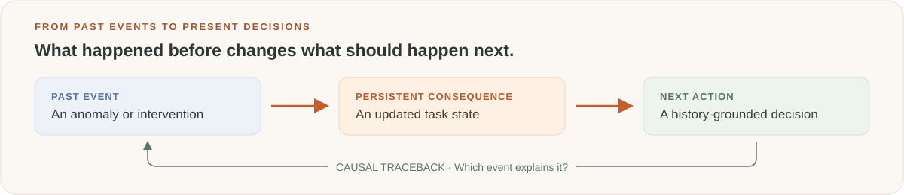
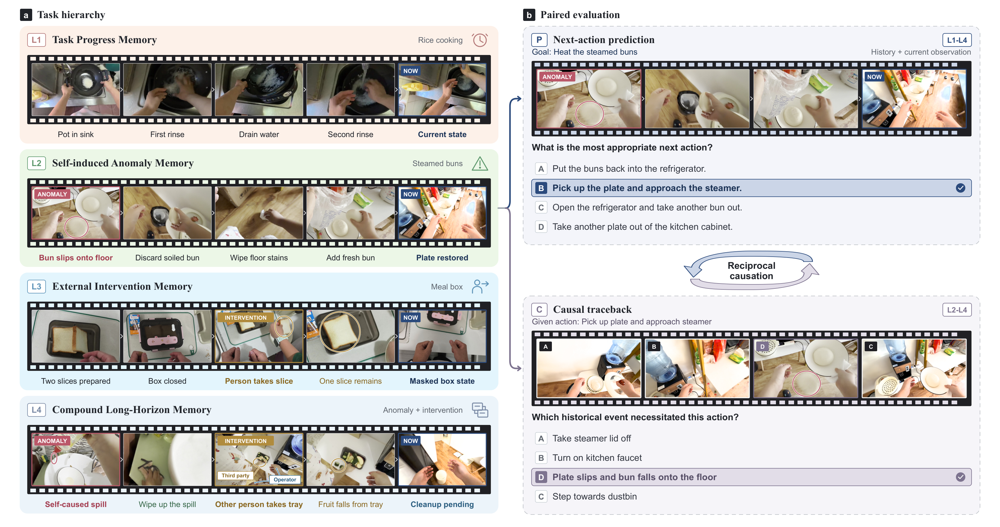

<div align="center">

# EMBER-Bench

### Benchmarking Cross-Event Causal Memory in Long-Horizon Embodied Tasks

**Which past event matters for the next action?**

[Homepage](https://Alex0605goat.github.io/EMBER-Bench/) · [Leaderboard](https://Alex0605goat.github.io/EMBER-Bench/leaderboard.html) · [Evaluation code](evaluation/README.md)



**189 household tasks · 699 questions · 4 memory scenarios · 2 reasoning directions**

</div>

## What EMBER-Bench measures

EMBER-Bench evaluates cross-event causal memory in recorded egocentric household activities. Models must use the continuing consequences of earlier events to decide what to do next after those events leave view. At fixed decision points, four-option questions evaluate **next-action prediction (P)** and **causal traceback (C)**. This is an offline reasoning benchmark; the task does not execute a robot policy.



Original figures: [Introduction](docs/assets/figures/benchmark_overview_film.pdf) · [Construction design](docs/assets/figures/benchmark_design.png) · [Dataset diversity](docs/assets/figures/benchmark_diversity.pdf) · [Experimental analysis](docs/assets/figures/section4_analysis.pdf). The website displays these figures with links to their unmodified source files.

| Scenario | Memory requirement | P questions | C questions |
|---|---|---:|---:|
| **L1 · Task Progress** | Completed steps and prerequisites | 205 | — |
| **L2 · Self-induced Anomaly** | Lingering consequences of the performer's mistakes | 113 | 58 |
| **L3 · External Intervention** | Object state changes caused by another person | 128 | 60 |
| **L4 · Compound Long-Horizon** | Multiple dependencies across intervening activities | 102 | 33 |
| **Total** | | **548** | **151** |

The 151 traceback questions are paired with prediction questions from the same decision points. Fine-grained event and causal annotations support the construction and diagnostic ablations.

## Results from the paper

The interactive [leaderboard](https://Alex0605goat.github.io/EMBER-Bench/leaderboard.html) contains the complete Table 2 snapshot: all 16 models, 10 accuracy columns, and a separate human reference. Search models, filter source class, sort each score column, and export CSV.

| Reference | Overall | Prediction · P | Traceback · C |
|---|---:|---:|---:|
| Human, mean of 2 evaluators | **98.3** | 97.8 | 100.0 |
| Gemini 3.8 Flash, best evaluated model | **61.2** | 58.4 | 71.5 |
| Random-choice reference | 25.0 | 25.0 | 25.0 |

All values are accuracy (%). Human and chance references are excluded from model ranks. Overall accuracy counts all 699 questions; unanswered items are incorrect.

Across six models in the information ablation, action logs add **1.6 percentage points** on average. Privileged cause-and-consequence annotations add a further **13.0 points**. Correct traceback does not ensure a correct next-action prediction in the paired analysis. These findings concern the manuscript's reported settings; privileged annotations are diagnostic inputs.

## Evaluate a model

The complete public dataset release is **pending**. The evaluator accepts an actual catalog and pre-decision media once available. An offline synthetic smoke test verifies the runner without the dataset or paid API calls.

```bash
cd evaluation
python -m pip install -r requirements.txt
python ember_eval.py --help
```

See [evaluation README](evaluation/README.md) for the offline smoke test, catalog specification, model configuration, API-key environment variables, evaluation conditions, resume behavior, and result export. [Quick start](evaluation/QUICKSTART.md) and [usage reference](evaluation/docs/USAGE.md) provide complete commands.

**Protocol boundary:** the provided unified runner differs from some model settings used for the frozen paper results. See the protocol comparison in the evaluation documentation. Running this code is not a claim of exact reproduction of Table 2. Offline tests and synthetic results must never be submitted as benchmark scores.

Submit reproducible candidate results through a pull request using the [leaderboard review guide](docs/LEADERBOARD.md). Review is required before any website update.

## Website and repository

```text
docs/                     GitHub Pages homepage, leaderboard, and original figures
evaluation/               Runner, model registry, tests, synthetic fixture, and guides
scripts/validate_site.py  Local link and paper-table consistency checks
.github/workflows/        CI validation and GitHub Pages deployment
REVIEW.md                 Release audit and verification evidence
```

Preview locally:

```bash
python -m http.server 8000 --directory docs
```

Open `http://localhost:8000/`. See [website development and deployment](docs/DEVELOPMENT.md) for GitHub Pages setup and account alignment. Repository links use the owner **Alex0605goat**, matching the authenticated GitHub account.

The evaluation software is provided under its [MIT license](evaluation/LICENSE). This software license does not establish a license for the manuscript or the pending dataset release.
