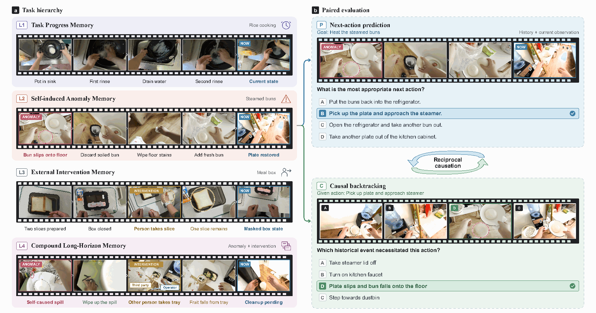
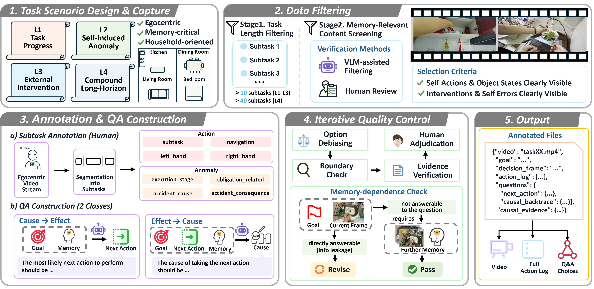
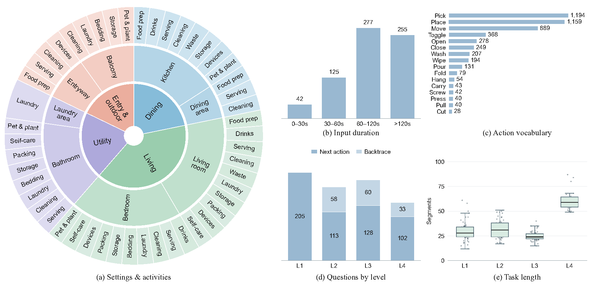

<h1 align="center">
<picture>
<source media="(max-width: 600px)" srcset="assets/title-mobile.svg">

</picture>
</h1>

[**Abstract**](README.md#abstract) · [**Benchmark**](README.md#benchmark) · [**Leaderboard**](README.md#leaderboard) · [**Dataset Release**](README.md#dataset-release)

<table>
<tr>
<td align="center"><strong>189</strong> Household tasks</td>
<td align="center"><strong>699</strong> QA pairs</td>
<td align="center"><strong>4</strong> Memory scenarios</td>
<td align="center"><strong>2</strong> Reasoning directions</td>
</tr>
</table>

## News

> **The full EMBER-Bench dataset will be released soon.**
>
> This page presents the benchmark, its construction, and the main findings. Download links and release instructions will be added here when the full dataset is available.

- **September 2026** — Introducing **EMBER-Bench**: cross-event causal memory across task progress, self-induced anomalies, external interventions, and compound long-horizon tasks.

## Abstract

Lifelong physical agents must reason over extended interactions where past events continue to shape the world long after they disappear from view. Beyond recalling what happened, agents must infer how history changes the current state and constrains future actions. Yet existing embodied and video-memory benchmarks largely focus on historical retrieval and summary, leaving such history-dependent causal reasoning underexplored. We introduce EMBER-Bench, an egocentric benchmark for cross-event causal reasoning in long-horizon embodied tasks, for which we newly created the task design, video recording, and data annotation. It contains 189 household tasks and 699 QA pairs, spanning task progression, failure recovery, external interventions, and ultra-long-horizon tasks with distant dependencies and prerequisites, with fine-grained event and causal-chain annotations. EMBER-Bench evaluates reasoning in both directions: next-action prediction selects the next action from history, and causal traceback, given that action, identifies the historical event that makes it necessary. Input ablations that add action logs or privileged cause-and-consequence annotations to the video indicate which kind of historical information models fail to use. Across 16 models, the best reaches 61.2% overall, against 98.3% for human evaluators. At paired decision points, correct traceback is not associated with correct next-action prediction. Adding action logs yields a gain of 1.7 points, whereas cause-and-consequence annotations yield an additional gain of 13.0 points on top of that. These results suggest that converting past events into constraints on the current action remains a key difficulty for long-horizon embodied agents.

## Benchmark

**Which past event still matters for the next action?** EMBER-Bench evaluates whether models can use the continuing consequences of earlier events to make decisions after those events leave view.

*Four memory scenarios, with complementary questions about what to do next and which earlier event makes that action necessary. Click any figure to view it at full resolution.*

### Four memory scenarios

| Level | Scenario | What the model must remember |
|:--:|---|---|
| **L1** | **Task Progress Memory** | Completed steps and prerequisites that determine the current task state. |
| **L2** | **Self-induced Anomaly Memory** | The lasting consequences of the performer's own mistakes and outstanding recovery obligations. |
| **L3** | **External Intervention Memory** | Third-party changes to the location, identity, or availability of task-relevant objects. |
| **L4** | **Compound Long-Horizon Memory** | Self-induced anomalies and external interventions within the same long-horizon task episode. |

### Two reasoning directions

| Next-action prediction · **P** | Causal traceback · **C** |
|---|---|
| Given the task goal, pre-decision history, and current frame, select the appropriate next action. | Given the reference next action, identify the historical event that makes it necessary. |
| **548 questions** across L1–L4. | **151 questions** across L2–L4, paired with a subset of the prediction questions. |

The benchmark uses fixed decision points in recorded human activities. It evaluates history-grounded reasoning through four-option questions, rather than measuring a robot's closed-loop execution.

## How the Benchmark Is Built

*New task design and video recording, followed by action and causal annotation, paired QA construction, and iterative quality review.*

- **Newly collected household tasks.** Task scenarios, recordings, and annotations are created for this benchmark.
- **Action and causal annotations.** Fine-grained records connect actions, anomalies, consequences, and recovery obligations.
- **Memory dependence.** Questions are reviewed so that the relevant history is needed to distinguish the correct next action.
- **Quality control.** Human review checks historical evidence, answer uniqueness, option bias, and input boundaries.

## Dataset at a Glance

*Distribution of household scenes and activities, input duration, action vocabulary, question types, and task lengths.*

| Property | Full EMBER-Bench |
|---|---|
| Household tasks / original videos | **189** |
| Total QA pairs | **699** |
| Next-action prediction questions | **548** |
| Causal traceback questions | **151** |
| Matched prediction–traceback decision points | **151** |
| Memory scenarios | **L1–L4** |
| Input viewpoint | **Egocentric video** |
| Answer format | **Four-option multiple choice** |

## Leaderboard

Complete main results from the manuscript's Table 2, evaluated under the **video-history setting (V)**. All values are **accuracy (%)**. The table includes **16 models** and the mean performance of **two human evaluators**.

<table>
<thead>
<tr>
<th rowspan="2" align="left">Model</th>
<th rowspan="2">Overall</th>
<th colspan="5">Next-action prediction (P)</th>
<th colspan="4">Causal traceback (C)</th>
</tr>
<tr>
<th>All</th><th>L1</th><th>L2</th><th>L3</th><th>L4</th>
<th>All</th><th>L2</th><th>L3</th><th>L4</th>
</tr>
</thead>
<tbody>
<tr><td><em>Human (mean of 2)</em></td><td align="right">98.3</td><td align="right">97.8</td><td align="right">100.0</td><td align="right">96.9</td><td align="right">97.7</td><td align="right">94.6</td><td align="right">100.0</td><td align="right">100.0</td><td align="right">100.0</td><td align="right">100.0</td></tr>
<tr><th colspan="11" align="left">Closed-source models</th></tr>
<tr><td>Gemini 3.8 Flash</td><td align="right"></td><td align="right"></td><td align="right"></td><td align="right"></td><td align="right"></td><td align="right"></td><td align="right"></td><td align="right"></td><td align="right"></td><td align="right">60.6</td></tr>
<tr><td>Gemini 3.1 Pro</td><td align="right">51.5</td><td align="right">50.7</td><td align="right">61.0</td><td align="right">47.8</td><td align="right">40.6</td><td align="right">46.1</td><td align="right">54.3</td><td align="right">48.3</td><td align="right">68.3</td><td align="right">39.4</td></tr>
<tr><td>doubao-seed-pro2.1</td><td align="right">49.8</td><td align="right">45.4</td><td align="right">55.6</td><td align="right">38.9</td><td align="right">43.8</td><td align="right">34.3</td><td align="right">65.6</td><td align="right">55.2</td><td align="right">76.7</td><td align="right"></td></tr>
<tr><td>Qwen3.8 Max</td><td align="right">47.5</td><td align="right">44.2</td><td align="right">52.2</td><td align="right">39.8</td><td align="right">44.5</td><td align="right">32.4</td><td align="right">59.6</td><td align="right">56.9</td><td align="right">68.3</td><td align="right">48.5</td></tr>
<tr><td>GPT-6 Sol</td><td align="right">46.2</td><td align="right">44.2</td><td align="right">57.1</td><td align="right">41.6</td><td align="right">32.8</td><td align="right">35.3</td><td align="right">53.6</td><td align="right">51.7</td><td align="right">58.3</td><td align="right">48.5</td></tr>
<tr><td>Qwen3.8 Omni Flash</td><td align="right">45.6</td><td align="right">44.3</td><td align="right">55.1</td><td align="right">36.3</td><td align="right">43.8</td><td align="right">32.4</td><td align="right">50.3</td><td align="right">43.1</td><td align="right">56.7</td><td align="right">51.5</td></tr>
<tr><td>Qwen3.8 Flash</td><td align="right">36.8</td><td align="right">34.7</td><td align="right">39.0</td><td align="right">31.9</td><td align="right">35.9</td><td align="right">27.5</td><td align="right">44.4</td><td align="right">43.1</td><td align="right">50.0</td><td align="right">36.4</td></tr>
<tr><th colspan="11" align="left">Open-source models</th></tr>
<tr><td>Qwen3.5 397B-A17B</td><td align="right">45.4</td><td align="right">43.8</td><td align="right">52.7</td><td align="right">42.5</td><td align="right">38.3</td><td align="right">34.3</td><td align="right">51.0</td><td align="right">48.3</td><td align="right">61.7</td><td align="right">36.4</td></tr>
<tr><td>Qwen3.5 35B-A3B</td><td align="right">39.5</td><td align="right">38.5</td><td align="right">45.9</td><td align="right">34.5</td><td align="right">35.2</td><td align="right">32.4</td><td align="right">43.0</td><td align="right">41.4</td><td align="right">50.0</td><td align="right">33.3</td></tr>
<tr><td>Qwen3.5 122B-A10B</td><td align="right">38.2</td><td align="right">35.8</td><td align="right">45.4</td><td align="right">29.2</td><td align="right">34.4</td><td align="right">25.5</td><td align="right">47.0</td><td align="right">44.8</td><td align="right">56.7</td><td align="right">33.3</td></tr>
<tr><td>Qwen3.8 27B</td><td align="right">38.1</td><td align="right">36.7</td><td align="right">42.4</td><td align="right">31.0</td><td align="right">38.3</td><td align="right">29.4</td><td align="right">43.0</td><td align="right">41.4</td><td align="right">48.3</td><td align="right">36.4</td></tr>
<tr><td>MiMo V2.6 Pro</td><td align="right">35.8</td><td align="right">33.4</td><td align="right">39.5</td><td align="right">30.1</td><td align="right">33.6</td><td align="right">24.5</td><td align="right">44.4</td><td align="right">41.4</td><td align="right">51.7</td><td align="right">36.4</td></tr>
<tr><td>Qwen3-VL 32B</td><td align="right">34.5</td><td align="right">32.5</td><td align="right">41.0</td><td align="right">27.4</td><td align="right">28.9</td><td align="right">25.5</td><td align="right">41.7</td><td align="right">43.1</td><td align="right">46.7</td><td align="right">30.3</td></tr>
<tr><td>MiMo V2.6 Flash</td><td align="right">32.3</td><td align="right">28.5</td><td align="right">32.2</td><td align="right">27.4</td><td align="right">27.3</td><td align="right">23.5</td><td align="right">46.4</td><td align="right">44.8</td><td align="right">51.7</td><td align="right">39.4</td></tr>
<tr><td>Qwen3-VL 8B</td><td align="right">29.0</td><td align="right">29.9</td><td align="right">33.7</td><td align="right">30.1</td><td align="right">31.2</td><td align="right">20.6</td><td align="right">25.8</td><td align="right">29.3</td><td align="right">28.3</td><td align="right">15.2</td></tr>
<tr><td>Qwen3-VL 235B-A22B</td><td align="right">28.9</td><td align="right">26.6</td><td align="right">32.7</td><td align="right">27.4</td><td align="right">18.8</td><td align="right">23.5</td><td align="right">37.1</td><td align="right">37.9</td><td align="right">40.0</td><td align="right">30.3</td></tr>
</tbody>
</table>

**P** = next-action prediction; **C** = causal traceback. Models are grouped as in the manuscript and sorted by overall accuracy within each group. **Red** marks the best model result in each column; the human reference is excluded from model ranking. Unanswered items after retries are scored as incorrect. Random-choice accuracy is **25%**.

## Key Findings

- **Remembering the cause does not ensure the right next action.** At matched decision points, correct traceback is not associated with correct prediction in the reported analysis.
- **The content of memory matters.** Across the six models in the information ablation, action logs add **1.7 percentage points** on average; cause-and-consequence annotations add a further **13.0 points**.
- **Compound scenarios remain difficult.** **12 of the 16 models** obtain their lowest next-action accuracy on L4.

*The cause-and-consequence annotations in the ablation are privileged information used for diagnosis; this setting does not measure independent causal inference.*

## Dataset Release

**The dataset will be released soon.** The complete EMBER-Bench release will be announced in the [News](README.md#news) section, together with download and usage instructions.

---

<strong>EMBER-Bench</strong> Cross-event causal memory for long-horizon embodied reasoning.

